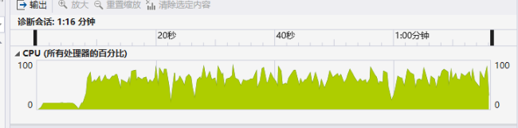

# 性能

对比 140 万次 TemplateRule 检查

并行检查：80 秒



* 检查 TemplateRule : 40 %
  * 单个规则检查 : 20 %
    * 从内部数据结构中访问属性 : 15 %
  * 内部数据逻辑运算与其他 : 20 %
* 构造内部数据结构 : 20 %
* 其他 : 40 %

串行检查 : 2:15 分钟


上周 并行检查 : 5 分钟


* 构造内部数据结构 : 40 %
  * 访问IFC属性 : 20 %
* 从内部数据结构中访问属性 : 30 %
* 其他 : 30 %

---

性能同时受 MVD 规则类型影响：

````xml
    <TemplateRule Parameters="Name_28[Value]='构件分类编码' AND NominalValue_29[Value]=reg'^10.05.10.35'" />
````

若含有较多的正则表达式规则，正则的生成与匹配会占用一定时间

