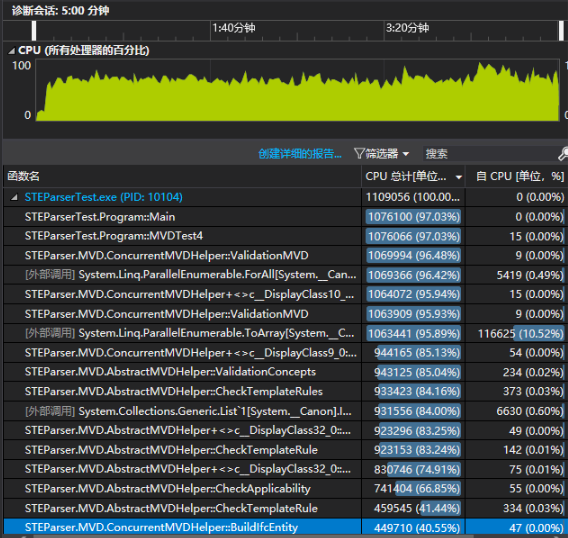

# MVD 检查

## 实现了线程安全的类

````csharp
    reqs.AsParallel().ForAll(
        requiremnt => result
            .TryAdd(
                requiremnt,
                ValidationMVD(ifcEntity, modelViewUuid, requiremnt)
                ));
````
----

## MVD 信息提取

````javascript
    // ...
    "属性集": [
        { "Key": "桥架材质", "AttributePosition": "类型属性" },
        { "Key": "设备类型", "AttributePosition": "实例属性" }
    ],
    "RelRequirements": [
    {
        "关系": "IsTypedBy", "类型": "IfcRelDefinesByType",
        "FromAttribute": "RelatedObjects",
        "ToAttribute": "RelatingType",
        "RelatedEntityType": "IFCCableCarrierFitting"
    },
    {
        "关系": "IsDefinedBy", "类型": "IfcRelDefinesByProperties",
        "FromAttribute": "RelatedObjects",
        "ToAttribute": "RelatingPropertyDefinition",
        "RelatedEntityType": "IFCCableCarrierFitting"
    }
    // ...
````
----

## 性能



140 万次 TemplateRule 检查：5 分钟

* 构造内部数据结构 : 40 %
> * 访问IFC属性 : 20 %
* 从内部数据结构中访问属性 : 30 %
* 其他 : 30 %

信息提取：

````xml
    <TemplateRule Parameters="Name_28[Value]='构件分类编码' AND NominalValue_29[Value]=reg'^10.05.10.35'" />
````

正则表达式生成匹配 : 30%

